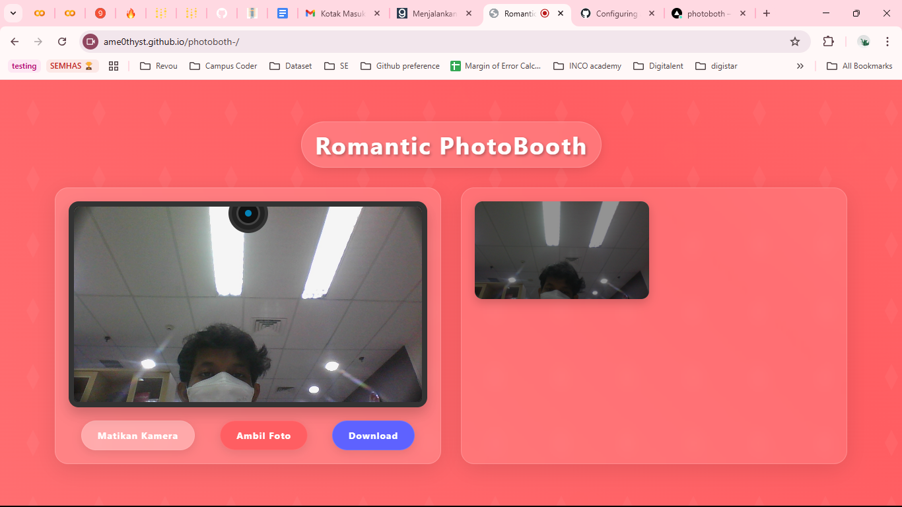

# 📸 PhotoBooth Web App

PhotoBooth adalah aplikasi web yang memungkinkan pengguna untuk mengambil foto langsung dari kamera mereka, menyimpan hasilnya, dan mengunduhnya dalam format individual atau ZIP. Aplikasi ini didesain dengan tema romantis, kehangatan, dan kekuatan, serta mendukung tampilan responsif baik di desktop maupun mobile.

## ✨ Fitur Utama

✅ **Akses Kamera** - Hidupkan atau matikan kamera dengan tombol "On/Off". Saat diaktifkan, kamera akan menampilkan wajah pengguna dalam jendela yang sesuai dengan ukuran aslinya.

📸 **Ambil Foto** - Klik tombol "Foto" untuk mengambil gambar dengan hitungan mundur 2 detik.

🖼 **Galeri Foto** - Hasil foto akan muncul di sebelah kanan layar secara perlahan. Jika ada lebih dari satu foto, gambar akan tersusun secara horizontal.

🎭 **Efek Hover** - Saat mengarahkan kursor ke salah satu foto, gambar akan sedikit membesar dan naik, sementara foto lainnya akan menjadi lebih gelap.

📥 **Download Foto** - Unduh foto individual atau semua gambar dalam format ZIP untuk disimpan di perangkat.

📱 **Tampilan Responsif** -

- **Desktop:** Kamera berada di sebelah kiri, galeri foto di sebelah kanan.
- **Mobile:** Kamera berada di tengah, dan galeri dapat diakses melalui tombol yang membuka popup berisi semua foto.

🎨 **Desain Modern & Realistik** - Menggunakan efek kaca dan elemen visual untuk tampilan yang menarik, tidak hanya warna polos.

---

## 🚀 Cara Menggunakan

1. **Berikan Izin Akses Kamera**

   - Saat pertama kali membuka aplikasi, Anda akan diminta untuk mengizinkan akses kamera.
   - Jika terjadi masalah, pastikan:
     - Tidak ada aplikasi lain yang menggunakan overlay.
     - Browser telah diberi izin mengakses kamera.
     - Anda menggunakan browser yang mendukung akses kamera (Google Chrome atau Mozilla Firefox).

2. **Nyalakan Kamera**

   - Klik tombol "On" untuk menyalakan kamera dan menampilkan wajah Anda.

3. **Ambil Foto**

   - Tekan tombol "Foto", dan akan ada hitungan mundur 2 detik sebelum gambar diambil.

4. **Lihat & Interaksi dengan Galeri**

   - Foto yang diambil akan muncul di sebelah kanan (desktop) atau di dalam popup (mobile).
   - Hover pada foto untuk melihat efek zoom dan highlight.

5. **Unduh Foto**
   - Klik tombol "Download" untuk menyimpan foto ke perangkat.
   - Jika ada lebih dari satu foto, semua akan diunduh dalam format ZIP.

---

## 🖼 Tampilan Aplikasi

📌 **Catatan:** Jika Anda mengalami masalah saat mengakses kamera, pastikan browser Anda memiliki izin dan tidak ada aplikasi lain yang menggunakan overlay.

🎉 Selamat bersenang-senang dengan PhotoBooth! Jika ada saran atau bug, silakan laporkan. 😊
